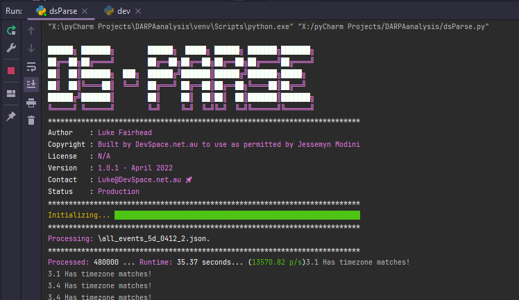

# Data Parsing - DARPA Dataset

#### April 2022 ** Updated 30/04/2022 1:31 AM **

## Scope

#### Client Description

    Download parsed data (to be provided) for DARPA dataset (TRACE, THEIA, and Fivedirection). The data from the parsed files is labeled as "malicious" by the timestamp (+/- 2 min) of the event logs of the pdf file. But it is not accurate.

    Need help to refer the information of the pdf file (provided) to the timestamps of the event logs. underlying file
    format is python and json.
    
    Original data all public source https://github.com/darpa-i2o/Transparent-Computing/blob/master/README-E3.md
    For each scenario, the interactions include files, processes and con*nections of events. 

#### Relevant Files

    Jess' copy of files: 
    -------------------------
    * https://drive.google.com/drive/folders/1VMNNBGNpumoLUJlyNV0UYYrWvm53Rzx-?usp=sharing
    
    Context: 
    -------------------------
    * https://github.com/darpa-i2o/Transparent-Computing
    
    Original Dataset: 
    -------------------------
    * https://drive.google.com/drive/folders/1okt4AYElyBohW4XiOBqmsvjwXsnUjLVf

## Technical Information

For each category, there is a .7z file containing multiple .JSON files. The contents of each *.json file corresponds directly to the "TC_Ground_Truth_Report_E3_Update.pdf" project outline.

#### Original Parser

The original parser extracted data and pulled into the *.JSON files with the idea of using the 'timestamp' field as an indicator of compromise.

This is inaccurate as it does not take into consideration actual IOC messages for the other fields within the .JSON file.

#### JSON Schema Example

    {
        "subj": {
            "uuid": "1B6256B3-0100-0000-0000-000000000020",
            "type": "Subject",
            "n_attrbiute": {
                "cmdline": "/usr/lib/thunderbird/thunderbird",
                "image": "/usr/lib/thunderbird/thunderbird",
                "pid": 25115
            }
        },
        "relation": "EVENT_OPEN",
        "obj": {
            "uuid": "0100D00F-A30E-2600-0000-000091BA7600",
            "type": "FileObject",
            "n_attrbiute": {
                "filepath": "/home/admin/.thunderbird/pu7u3e84.default/datareporting/session-state.json.tmp"
            }
        },
        "timestamp": 1522900800013353595,
        "label": "benign"
    }

#### New Parser

The above JSON is nested, and in a lot of cases has not been structured correctly, which was causing errors on read/save and making it difficult to access fields due to reading them as standalone objects etc.

I have flattened this JSON into the new structure below, to give full access.

#### New JSON Structure

As below, this is restructured to allow access to all fields, with the only parent being 'data'.

The reason for the 'data' parent field is because each file is processed in chunks of 10,000 and written back to a *.gz file.

This gives structure back to the *.json dataset and will assist with future parsing.

You will also notice that I have added 3 new fields:

- RecordUid - This gives each record it's own specific UID, to be used as a Primary Key if loaded to a database.
- Source - The source file that this processed chunk is from.
    - pdfSection - The relevant section within the PDF, if matched - for validation purposes.
        - Note: The idea here is to be able to quickly filter down based on that section.

                {
                  "data": {
                      "relation": "EVENT_READ_SOCKET_PARAMS",
                      "timestamp": 1522900800001712194,
                      "label": "Within Attack Range",
                      "subj.uuid": "AC061100-0000-0000-0000-000000000020",
                      "subj.type": "Subject",
                      "subj.n_attrbiute.cmdline": "Xvnc4 :1 -desktop my-vnc-server -auth \\/home\\/admin\\/.Xauthority -geometry 1024x768 -depth 16 -rfbwait 30000 -rfbauth \\/home\\/admin\\/.vnc\\/passwd -rfbport 5901 -pn -fp \\/usr\\/X11R6\\/lib\\/X11\\/fonts\\/Type1\\/,\\/usr\\/X11R6\\/lib\\/X11\\/fonts\\/Speedo\\/,\\/usr\\/X11R6\\/lib\\/X11\\/fonts\\/misc\\/,\\/usr\\/X11R6\\/lib\\/X11\\/fonts\\/75dpi\\/,\\/usr\\/X11R6\\/lib\\/X11\\/fonts\\/100dpi\\/,\\/usr\\/share\\/fonts\\/X11\\/misc\\/,\\/usr\\/share\\/fonts\\/X11\\/Type1\\/,\\/usr\\/share\\/fonts\\/X11\\/75dpi\\/,\\/usr\\/share\\/fonts\\/X11\\/100dpi\\/ -co \\/etc\\/X11\\/rgb",
                      "subj.n_attrbiute.image": "\\/usr\\/bin\\/Xvnc4",
                      "subj.n_attrbiute.pid": 1708,
                      "obj.uuid": "FDFFFFFF-0000-FFFF-FFFF-000000000040",
                      "obj.type": "NetFlowObject",
                      "obj.n_attrbiute.localAddress": "\\/tmp\\/.X11-unix\\/X0",
                      "obj.n_attrbiute.localPort": 0.0,
                      "obj.n_attrbiute.remoteAddress": "NA",
                      "obj.n_attrbiute.remotePort": 0.0,
                      "obj.n_attrbiute.ipProtocol": "None",
                      "obj.n_attrbiute.cmdline": null,
                      "obj.n_attrbiute.image": null,
                      "obj.n_attrbiute.pid": null,
                      "obj.n_attrbiute.filepath": null,
                      "recordUid": "689e6836-c7d0-4a7b-97ed-e5346469621f",
                      "Source": "X:\\\\pyCharm Projects\\\\DARPAanalysis\\\\RawFiles\\\\Theia\\\\all_events_theia_0406_0.json",
                      "pdfSection": 4.2
                  }
                }

## Logic

#### Timestamps

Timestamps are stored in an array of tuples, which allows us to directly query the start/end time range for a pdf section (eg. 4.2).

If matched, these are flagged within the data set as "Within attack range", and their pdfSection field is flagged with their relevant timestamp section (eg. 4.2).

#### IOC Messages

###### ** Update 30/04/2022 **

There is a file called .\EventLib\EventLog.json, which has the below structure:

    {
      "3.2":[
              {
                "obj.n_attrbiute.localAddress": "192.168.0.1",
                "obj.n_attrbiute.localPort": 80,
                "obj.n_attrbiute.remoteAddress": "101.123.255.0",
                "obj.n_attrbiute.remotePort": 3389
              }
            ]
    }

This allows you to create an "attack" that you would like to be flagged. The array names are mapped to the PDF section (eg. 3.2), and the field names are a direct match to the new .JSON structure.

For each simulated "attack", all fields must match. For example, in the above json - this is saying that the OBJECT section has a Local Address of 192.168.0.1 *AND* a Local Port of 80 *AND* a Remote Address of 101.123.255.0 AND a Remote Port of 3389.

If you also want to flag strictly remote port 3389, you would put include another object within the 3.2 array that just contains {"obj.n_attrbiute.remotePort": 3389}.

#### Process

The parser will then check all items flagged as "Within attack range". The purpose of this flag is for easy identification where a time match was made, but the IOC match could not be established. Therefore, we can easily filter these down and do some validation, ie. "were all attacks within x time flagged?"

If a chunk is flagged as having items "Within attack range", the pdfSection field is populated with the corresponding section within the PDF that owns the matched timestamp.

A secondary scan is then triggered for all items within this chunk that are "Within attack range", for the corresponding flags within this pdfSection. If the second match is made, the flag is upgraded to "Attack".
